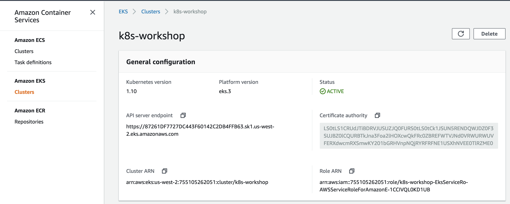
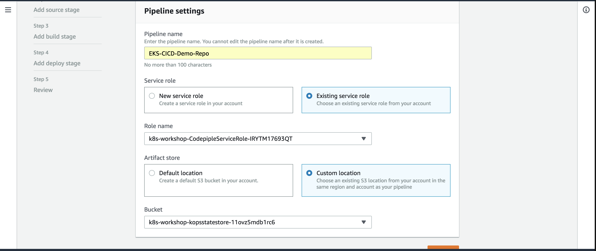
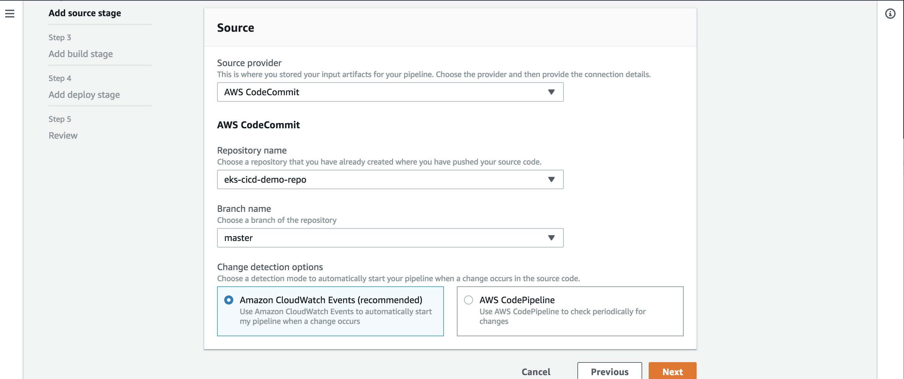
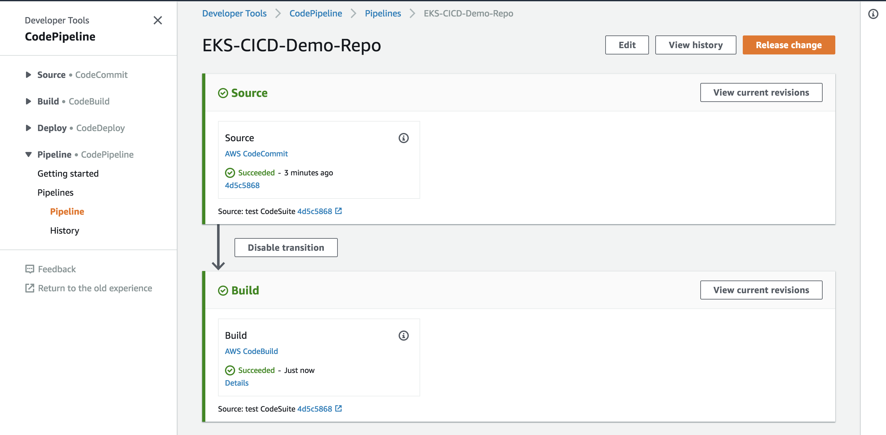
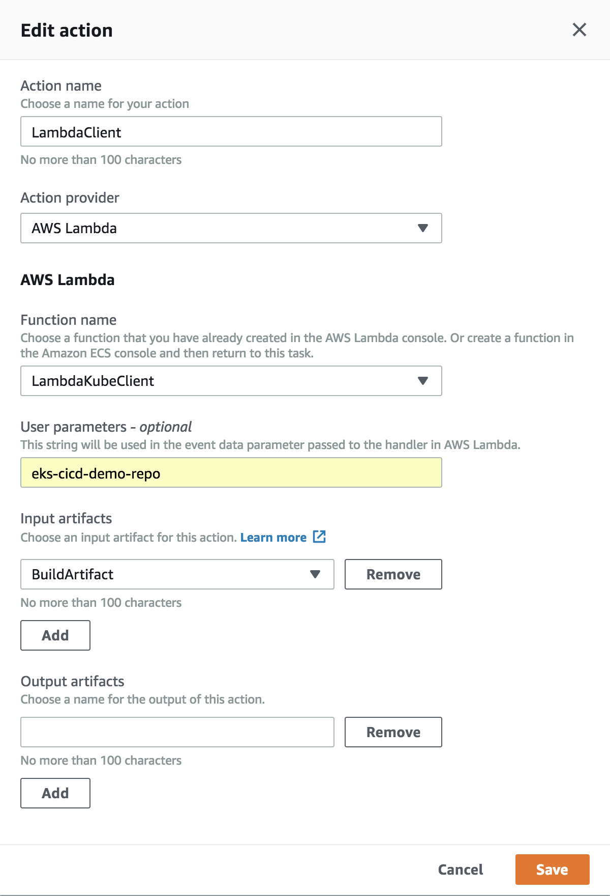
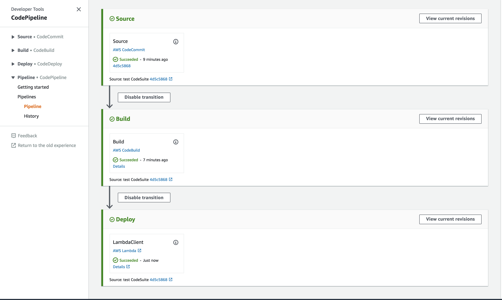

**Note:** All the below instructions are run from Cloud9 default terminal

#### Install jq 
```
sudo yum -y install jq
```

#### Update awscli
```
sudo -H pip install -U awscli
```

#### Install bash-completion
```
sudo yum install bash-completion -y
```

#### Install kubectl
```
curl -o kubectl https://amazon-eks.s3-us-west-2.amazonaws.com/1.10.3/2018-06-05/bin/linux/amd64/kubectl
chmod +x kubectl && sudo mv kubectl /usr/local/bin/
echo "source <(kubectl completion bash)" >> ~/.bashrc
```

#### Install Heptio Authenticator
```
curl -o aws-iam-authenticator https://amazon-eks.s3-us-west-2.amazonaws.com/1.10.3/2018-06-05/bin/linux/amd64/heptio-authenticator-aws
chmod +x ./aws-iam-authenticator && sudo mv aws-iam-authenticator /usr/local/bin/
```

#### Configure AWS CLI
```
availability_zone=$(curl http://169.254.169.254/latest/meta-data/placement/availability-zone)
export AWS_DEFAULT_REGION=${availability_zone%?}
```

#### Lab-specific configuration
```
export AWS_AVAILABILITY_ZONES="$(aws ec2 describe-availability-zones --query 'AvailabilityZones[].ZoneName' --output text | awk -v OFS="," '$1=$1')"
export AWS_INSTANCE_ID=$(curl -s http://169.254.169.254/latest/meta-data/instance-id)
aws ec2 describe-instances --instance-ids $AWS_INSTANCE_ID > /tmp/instance.json
export AWS_STACK_NAME=$(jq -r '.Reservations[0].Instances[0]|(.Tags[]|select(.Key=="aws:cloudformation:stack-name")|.Value)' /tmp/instance.json)
export AWS_ENVIRONMENT=$(jq -r '.Reservations[0].Instances[0]|(.Tags[]|select(.Key=="aws:cloud9:environment")|.Value)' /tmp/instance.json)
export AWS_MASTER_STACK=${AWS_STACK_NAME%$AWS_ENVIRONMENT}
export AWS_MASTER_STACK=${AWS_MASTER_STACK%?}
export AWS_MASTER_STACK=${AWS_MASTER_STACK#aws-cloud9-}
```

#### EKS-specific variables from CloudFormation
```
export EKS_VPC_ID=$(aws cloudformation describe-stacks --stack-name $AWS_MASTER_STACK | jq -r '.Stacks[0].Outputs[]|select(.OutputKey=="EksVpcId")|.OutputValue')
export EKS_SUBNET_IDS=$(aws cloudformation describe-stacks --stack-name $AWS_MASTER_STACK | jq -r '.Stacks[0].Outputs[]|select(.OutputKey=="EksVpcSubnetIds")|.OutputValue')
export EKS_SECURITY_GROUPS=$(aws cloudformation describe-stacks --stack-name $AWS_MASTER_STACK | jq -r '.Stacks[0].Outputs[]|select(.OutputKey=="EksVpcSecurityGroups")|.OutputValue')
export EKS_SERVICE_ROLE=$(aws cloudformation describe-stacks --stack-name $AWS_MASTER_STACK | jq -r '.Stacks[0].Outputs[]|select(.OutputKey=="EksServiceRoleArn")|.OutputValue')
```

#### Persist lab variables
```
echo "AWS_DEFAULT_REGION=$AWS_DEFAULT_REGION" >> ~/.bashrc
echo "AWS_AVAILABILITY_ZONES=$AWS_AVAILABILITY_ZONES" >> ~/.bashrc
echo "AWS_STACK_NAME=$AWS_STACK_NAME" >> ~/.bashrc
echo "AWS_MASTER_STACK=$AWS_MASTER_STACK" >> ~/.bashrc
```

#### Persist EKS variables
```
echo "EKS_VPC_ID=$EKS_VPC_ID" >> ~/.bashrc
echo "EKS_SUBNET_IDS=$EKS_SUBNET_IDS" >> ~/.bashrc
echo "EKS_SECURITY_GROUPS=$EKS_SECURITY_GROUPS" >> ~/.bashrc
echo "EKS_SERVICE_ROLE=$EKS_SERVICE_ROLE" >> ~/.bashrc
```

#### EKS-Optimized AMI
```
if [ "$AWS_DEFAULT_REGION" == "us-east-1" ]; then
  export EKS_WORKER_AMI=ami-dea4d5a1
elif [ "$AWS_DEFAULT_REGION" == "us-west-2" ]; then
  export EKS_WORKER_AMI=ami-73a6e20b
fi
echo "EKS_WORKER_AMI=$EKS_WORKER_AMI" >> ~/.bashrc
```

#### Create SSH key
```
ssh-keygen -t rsa -N "" -f ~/.ssh/id_rsa
```

#### Create EC2 Keypair
```
aws ec2 create-key-pair --key-name ${AWS_STACK_NAME} --query 'KeyMaterial' --output text > $HOME/.ssh/k8s-workshop.pem
chmod 0400 $HOME/.ssh/k8s-workshop.pem
```

#### Create kubernetes cluster
```
aws eks create-cluster \
  --name k8s-workshop \
  --role-arn $EKS_SERVICE_ROLE \
  --resources-vpc-config subnetIds=${EKS_SUBNET_IDS},securityGroupIds=${EKS_SECURITY_GROUPS} \
  --kubernetes-version 1.10
  ```

 #### Describe cluster to check the status
 ```
 aws eks describe-cluster --name k8s-workshop --query cluster.status --output text
 ```

 #### Create kube config file and run it.
 ```
aws s3 cp s3://aws-kubernetes-artifacts/v0.5/create-kubeconfig.sh . 
chmod +x create-kubeconfig.sh 
```

#### Visit [console](https://us-west-2.console.aws.amazon.com/eks/home?region=us-west-2#/clusters/k8s-workshop) for EKS status



#### Note: Run kube config only after cluster status become **ACTIVE**

```
. ./create-kubeconfig.sh
```

#### Test  kubectl configuration and connectivity using 'kubectl get service'
```
kubectl get service
```

#### Successful configuration will have similar output like this
```
NAME         TYPE        CLUSTER-IP   EXTERNAL-IP   PORT(S)   AGE
kubernetes   ClusterIP   10.100.0.1   <none>        443/TCP   6m
```
#### To launch your worker nodes, run the following CloudFormation CLI command:
```
aws cloudformation create-stack \
  --stack-name k8s-workshop-worker-nodes \
  --template-url https://amazon-eks.s3-us-west-2.amazonaws.com/1.10.3/2018-06-05/amazon-eks-nodegroup.yaml \
  --capabilities "CAPABILITY_IAM" \
  --parameters "[{\"ParameterKey\": \"KeyName\", \"ParameterValue\": \"${AWS_STACK_NAME}\"},
                 {\"ParameterKey\": \"NodeImageId\", \"ParameterValue\": \"${EKS_WORKER_AMI}\"},
                 {\"ParameterKey\": \"ClusterName\", \"ParameterValue\": \"k8s-workshop\"},
                 {\"ParameterKey\": \"NodeGroupName\", \"ParameterValue\": \"k8s-workshop-nodegroup\"},
                 {\"ParameterKey\": \"ClusterControlPlaneSecurityGroup\", \"ParameterValue\": \"${EKS_SECURITY_GROUPS}\"},
                 {\"ParameterKey\": \"VpcId\", \"ParameterValue\": \"${EKS_VPC_ID}\"},
                 {\"ParameterKey\": \"Subnets\", \"ParameterValue\": \"${EKS_SUBNET_IDS}\"}]" --region us-west-2
```

#### To enable worker nodes to join your cluster, download and run the aws-auth-cm.sh script.

```
aws s3 cp s3://aws-kubernetes-artifacts/v0.5/aws-auth-cm.sh . && chmod +x aws-auth-cm.sh
. ./aws-auth-cm.sh
```

#### Watch the status of your nodes and wait for them to reach the Ready status.
```
kubectl get nodes
```
#### Once the worker nodes are ready, you should see output similar to below
```
NAME                                            STATUS    ROLES     AGE       VERSION
ip-192-168-115-12.us-west-2.compute.internal    Ready     <none>    1m        v1.10.3
ip-192-168-130-204.us-west-2.compute.internal   Ready     <none>    1m        v1.10.3
ip-192-168-229-43.us-west-2.compute.internal    Ready     <none>    1m        v1.10.3
```

#### Now, let us deploy a sample docker application manually:
```

kubectl apply -f ./aws-eks-cicd-essentials/kube-manifests/deploy-first.yml

kubectl get svc codesuite-demo -o wide
```

You can test the application deployed by opening the external IP on a browser. You should be able to see an simple webpage for nginx.

**Note:** So far, we have create AWS EKS Cluster master, created worker nodes, deployed a sample application from client machine manually.

Rest of the lab, we will setup CICD pipeline along CodeCommit, CodeBuild service to do automated deployment to Amazon EKS cluster.

#### Create Code Repository for sample EKS project: *eks-cicd-demo-repo*
```
aws codecommit create-repository --repository-name eks-cicd-demo-repo --repository-description "EKS CICD demonstration repository" --region us-west-2
```

#### Create Container repository for docker image: *eks-cicd-demo-repo*
```
aws ecr create-repository --repository-name eks-cicd-demo-repo --region us-west-2
```

#### Connect to CodeCommit Repo and push the sample project: Note you need Git credentials to complete this.
```
git config --global credential.helper '!aws codecommit credential-helper $@'
git config --global credential.UseHttpPath true
git clone https://git-codecommit.us-west-2.amazonaws.com/v1/repos/eks-cicd-demo-repo
cp aws-eks-cicd-essentials/sample-app/* eks-cicd-demo-repo/
cd eks-cicd-demo-repo
git add . && git commit -m "test sample app" && git push origin master
```

#### Create pipeline with Build project before proceeding with this step.

Visit [Codepipeline console](https://us-west-2.console.aws.amazon.com/codepipeline/home?region=us-west-2). Click **create pipeline**

- Enter Name as **EKS-CICD-Demo-Repo**
- Select Service role as **Existing service role**
- Choose Role name starting with **k8s-workshop**
- Select Artifact store as **Custom location**
- Choose Bucket starting with **k8s-workshop**
- Click **Next**



Add the Source stage:
- Select the source provider as **AWS CodeCommit**
- Select the repository as **eks-cicd-demo-repo**
- Select the branch as **master**
- Click **Next**



Add the Build stage:
- Select the build provider as **AWS CodeBuild**
- Click the **Create Project** link
- Add project name as **eks-build-project**
- Select operating system as **Ubuntu**
- Select runtime as **Docker**
- Select the latest runtime version
- Choose Service role as **Existing service role**
- Select role name starting with **k8s-workshop**
- Uncheck **Allow AWS CodeBuild to modify this service role**
12- Expand the additional  configuration section and add ACCOUNT_ID, IMAGE_REPO_NAME as environment variables for CodeBuild project. For ACCOUNT_ID add your 12 digit aws account as value and for IMAGE_REPO_NAME add **eks-cicd-demo-repo** as value
- Click **Next**
- Click **skip deployment** and save the pipeline



Once the pipeline is successfully tested for build. Let us proceed setting up Lambda function to act as client to deploy our application.

#### Setup Lambda client for kubernetes cluster:
```
cd ..
git clone https://github.com/BranLiang/lambda-eks
cd lambda-eks

sed -i -e "s#\$EKS_CA#$(aws eks describe-cluster --name k8s-workshop --query cluster.certificateAuthority.data --output text)#g" ./config
sed -i -e "s#\$EKS_CLUSTER_HOST#$(aws eks describe-cluster --name k8s-workshop --query cluster.endpoint --output text)#g" ./config
sed -i -e "s#\$EKS_CLUSTER_NAME#k8s-workshop#g" ./config
sed -i -e "s#\$EKS_CLUSTER_USER_NAME#lambda#g" ./config
```
#### Run the following command to check the scerets:
```
kubectl get secrets
```
Output will be as shown below:
```
NAME                  TYPE                                  DATA      AGE
default-token-dwfwk   kubernetes.io/service-account-token   3         22m
```
#### Run the following command replacing $SECRET_NAME with secret name from the above query to update your token
```
sed -i -e "s#\$TOKEN#$(kubectl get secret $SECRET_NAME -o json | jq -r '.data["token"]' | base64 -d)#g" ./config
```

#### Build,Package and deploy the Lambda Kube Client Function 
```
npm install
zip -r lambda-package_v1.zip .
export LAMBDA_SERVICE_ROLE=$(aws cloudformation describe-stacks --stack-name $AWS_MASTER_STACK | jq -r '.Stacks[0].Outputs[]|select(.OutputKey=="LambdaExecutionRoleArn")|.OutputValue')
aws lambda create-function --function-name LambdaKubeClient --runtime nodejs8.10 --role $LAMBDA_SERVICE_ROLE --handler index.handler  --zip-file fileb://lambda-package_v1.zip --timeout 10 --memory-size 128
```

#### Providing admin access for default service account
```
kubectl create clusterrolebinding default-admin --clusterrole cluster-admin --serviceaccount=default:default
```

#### Edit Codepipeline to add Deployment stage using created Lambda function.

- Click **Edit** Codepipeline
- Add a new stage after BuildStage
- Enter stage name as **Deploy** and save.
- Add an Action group within the stage.
- Enter Action name as **LambdaClient**
- Select Action provider as **Lambda**
- Select Lambda function **LambdaKubeClient**
- Enter User parameter as **eks-cicd-demo-repo**
- Select the input artifact as **BuildArtifact**
- Click **Save**



Again, **Save** the pipeline changes. And release the changes by clicking **Release change**




#### Finally, test deployment status of the application after the codepipeline completed:
```
kubectl get deployment eks-cicd-demo-repo -o wide
```

### Clean up
 
[Click here for steps](./cleanup.md)